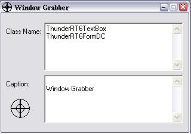



## A Window Handle Grabber \(a\.k\.a\. API Spy\) Updated \*\*\*

### Description

***Updated Again (3/15/03)*** Drag the cursor over a window and get all of the parent Class Names and Captions, which are needed in the FindWindow() and FindWindowEx() API calls. Changed code (made it faster by using arrays and while loops instead of ifs)! Great tool, a lot easier to use than Spy++ (comes with VStudio) KEYWORDS: API api Api Spy SPY spy Class CLASS class NAMES names Names jaime Jaime Muscatelli MUSCATELLI Array array
 
### More Info
 

             |
---                |---
**Submitted On**   |2003-03-17 02:30:24
**By**             |[Jaime Muscatelli](https://github.com/Planet-Source-Code/PSCIndex/blob/master/ByAuthor/jaime-muscatelli.md)
**Level**          |Intermediate
**User Rating**    |4.9 (88 globes from 18 users)
**Compatibility**  |VB 6\.0
**Category**       |[Windows API Call/ Explanation](https://github.com/Planet-Source-Code/PSCIndex/blob/master/ByCategory/windows-api-call-explanation__1-39.md)
**World**          |[Visual Basic](https://github.com/Planet-Source-Code/PSCIndex/blob/master/ByWorld/visual-basic.md)
**Archive File**   |[A\_Window\_H1560793172003\.zip](https://github.com/Planet-Source-Code/jaime-muscatelli-a-window-handle-grabber-a-k-a-api-spy-updated__1-42017/archive/master.zip)

